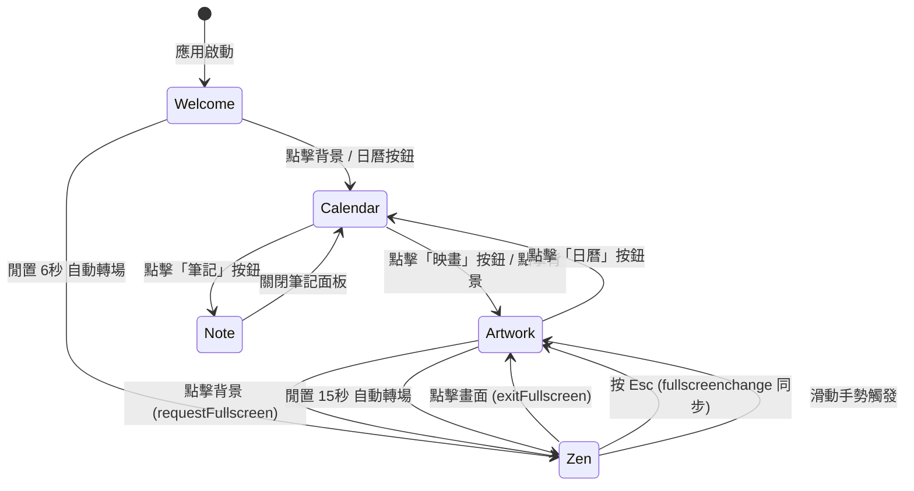

# 實作計畫：農民曆 PWA — 沉浸式時間藝術品

**日期**：2026-02-17 | **規格**：SDD_v1/spec.md

**輸入**：功能規格說明 (spec.md)、專案原始碼

**注意**：本文件為 Brownfield（漸進式強化）計畫——專案已有完整的可運作程式碼基礎，此實作計畫聚焦於「規格驅動」的系統化盤點與未來演進路線。

---

## 摘要

農民曆 PWA 是一款將傳統農曆數位化的沉浸式視聽應用，採用 Astro 框架 + TypeScript + 事件驅動架構構建。核心功能涵蓋五種操作模式的狀態機管理、農曆數據計算引擎、4K 背景圖片輪播系統、音樂播放器、動態主題引擎與 PWA 離線能力。本計畫基於已完成的程式碼基礎，系統化定義版面配置規範、按鈕狀態轉移邏輯、事件契約與品質驗收標準。

---

## 技術上下文 (Technical Context)

**語言／版本**：TypeScript (ES2022+)，強制 ES Modules  
**主要框架**：Astro v4.16+ (群島架構)  
**主要相依性**：@vite-pwa/astro、lunar-javascript（本地移植）  
**儲存方式**：IndexedDB（自訂媒體）+ localStorage（偏好設定）— 零伺服器  
**測試**：ESLint Zero Errors（前端）、Ruff（Python 腳本）  
**目標平台**：Modern Browsers (Chrome 90+, Safari 15+, Firefox 90+)，PWA 安裝  
**專案類型**：Single-page PWA（Astro SSG 輸出）  
**效能目標**：首屏 ≤8s（含超時保護）、模式切換 ≤200ms、背景動畫 60fps  
**限制條件**：
- 農曆計算範圍 1900-2100
- 強制 HTTPS（音訊串流）
- 觸控區域 ≥44×44px
- 零第三方 UI 框架（純原生 DOM API）

**規模／範疇**：  
- 5 種操作模式  
- 7 種色彩主題  
- 20+ 種 CustomEvent 契約  
- ~30 個 TypeScript 模組  
- ~15 個 CSS 樣式模組  
- ~10 個 Astro 組件  

---

## 專案憲章檢查 (Constitution Check)

| 憲章原則 | 符合狀態 | 備註 |
|----------|----------|------|
| I. 數位高級感優先 | ✅ | 玻璃擬態、1.6s 絲綢轉場、60fps 動畫、無噪點 |
| II. 模組化與職責分離 | ✅ | Manager/Handler/Renderer/Orchestrator 四層+ 分離 |
| III. 類型安全不可協商 | ✅ | CustomEvent 全泛型定義於 types.ts |
| IV. 品質門檻 | ✅ | ESLint Zero Errors 政策執行中 |
| V. 響應式行動優先 | ✅ | clamp()、vw/vh、4 段斷點 |
| VI. 命名即文件 | ✅ | kebab-case 檔案、BEM-inspired class |
| VII. 簡單性 YAGNI | ✅ | 無第三方 UI 框架、原生 DOM |

---

## 專案結構

### 文件（本功能 — SDD_v1）

```text
SDD_v1/
├── constitution.md      # 專案憲章（/speckit.constitution）
├── spec.md              # 功能規格說明（/speckit.specify）
├── plan.md              # 本文件（/speckit.plan）
└── tasks.md             # 任務清單（/speckit.tasks）
```

### 原始碼（Repository 根目錄）

```text
lunar-calendar/
├── astro.config.mjs                    # Astro + PWA 設定
├── tsconfig.json                       # TypeScript 設定（@/ → src/）
├── package.json                        # 相依性與 npm scripts
├── eslint.config.js                    # ESLint 品質規範
│
├── public/
│   ├── assets/
│   │   ├── gallery/                    # 季節/節慶圖片資源
│   │   │   ├── gallery.json            # 圖片清單 manifest
│   │   │   ├── spring/ summer/ autumn/ winter/ default/
│   │   ├── fonts/                      # 字體資源
│   │   ├── audio/                      # 音訊資源
│   │   └── icons/                      # PWA 圖示
│   └── radio_music.html                # 電台管理頁面
│
├── src/
│   ├── pages/
│   │   └── index.astro                 # 唯一頁面入口
│   │
│   ├── layouts/
│   │   └── Layout.astro                # 全域 HTML 骨架
│   │
│   ├── components/
│   │   ├── Hero/                       # 英雄區塊組件群
│   │   │   ├── HeroSection.astro       # 組合容器
│   │   │   ├── HeroBackground.astro    # 4K 背景圖容器
│   │   │   ├── HeroHeader.astro        # 頂部資訊條
│   │   │   ├── HeroDock.astro          # 底部導航 Dock
│   │   │   ├── HeroGallerySubmenu.astro  # 藝廊控制選單
│   │   │   ├── WelcomeOverlay.astro    # 歡迎遮罩層
│   │   │   └── MusicPlayer.astro       # 音訊元素
│   │   │
│   │   ├── Calendar/                   # 日曆區塊組件群
│   │   │   ├── CalendarBoard.astro     # 日曆主板
│   │   │   ├── CalendarHeader.astro    # 日曆標題
│   │   │   └── CalendarGridContainer.astro  # 日曆網格容器
│   │   │
│   │   └── Panels/                     # 面板組件群
│   │       └── FloatingPanels.astro    # 浮動面板（年月/今日/FAQ）
│   │
│   ├── scripts/
│   │   ├── types.ts                    # 全域型別定義 ⭐
│   │   ├── SCRIPTS_ARCHITECTURE.md     # 腳本架構說明文件
│   │   │
│   │   ├── app/                        # 應用層
│   │   │   ├── appController.ts        # 初始化控制器
│   │   │   ├── stateManager.ts         # 全域狀態管理
│   │   │   ├── eventOrchestrator.ts    # 事件編排中心
│   │   │   ├── updateManager.ts        # 更新管理
│   │   │   └── resourceLoader.ts       # 資源加載器（進度條）
│   │   │
│   │   ├── core/                       # 核心運算
│   │   │   ├── lunar.ts                # 農曆計算引擎
│   │   │   ├── holidayService.ts       # 政府假日服務
│   │   │   └── appConfig.ts            # 應用設定
│   │   │
│   │   ├── hero/                       # 英雄區塊邏輯
│   │   │   ├── hero-main.ts            # Hero 初始化入口
│   │   │   ├── eventHandlers.ts        # Hero 事件處理（控制器）
│   │   │   ├── imageManager.ts         # 圖片加載與管理
│   │   │   ├── galleryManager.ts       # 藝廊模式管理
│   │   │   ├── galleryStorage.ts       # 自訂圖片 IndexedDB 存取
│   │   │   ├── slideshowManager.ts     # 輪播計時管理
│   │   │   ├── musicPlayer.ts          # 音樂播放器
│   │   │   ├── uiManager.ts            # UI 狀態管理（Facade）
│   │   │   ├── headerManager.ts        # 頂部 Header 管理
│   │   │   ├── idleManager.ts          # 閒置偵測
│   │   │   ├── imageRules.ts           # 圖片規則常量
│   │   │   ├── parallaxManager.ts      # 視差效果
│   │   │   ├── touchHandler.ts         # 觸控手勢處理
│   │   │   ├── pwaHandler.ts           # PWA 安裝處理
│   │   │   └── types.ts                # Hero 區域專用型別
│   │   │   ├── handlers/               # 子事件處理器
│   │   │   │   ├── modeHandler.ts      # 模式轉換副作用
│   │   │   │   └── navigationHandler.ts  # 導航事件處理
│   │   │   └── ui/                     # UI 子管理器
│   │   │
│   │   ├── calendar/                   # 日曆邏輯
│   │   │   ├── calendar-board.ts       # 日曆初始化
│   │   │   ├── calendarRenderer.ts     # 日曆渲染器
│   │   │   ├── calendarCellBuilder.ts  # 日期格構建器
│   │   │   ├── calendarEventHandlers.ts  # 日曆事件處理
│   │   │   └── types.ts               # 日曆專用型別
│   │   │
│   │   ├── panels/                     # 面板邏輯
│   │   │   ├── floating-panels.ts      # 面板初始化
│   │   │   └── ...                     # Renderer/Handler
│   │   │
│   │   ├── layout/
│   │   │   └── layout-main.ts          # 全域佈局工具
│   │   │
│   │   ├── ui/                         # 通用 UI 工具
│   │   │
│   │   └── generated/                  # 自動生成
│   │       ├── audioManifest.ts        # 音訊檔案清單
│   │       └── galleryManifest.ts      # 圖片檔案清單
│   │
│   ├── styles/
│   │   ├── tokens.css                  # 設計變項（Design Tokens）
│   │   ├── global.css                  # 全域樣式與模式可見性
│   │   ├── hero.css                    # Hero 區塊基礎
│   │   ├── calendar.css                # 日曆基礎
│   │   ├── panels.css                  # 面板基礎
│   │   ├── glass-card.css              # 玻璃擬態卡片
│   │   ├── splash.css                  # 載入畫面
│   │   ├── calendar-themes.css         # 主題入口
│   │   ├── hero/                       # Hero 細分樣式
│   │   ├── calendar/                   # 日曆細分樣式
│   │   ├── panels/                     # 面板細分樣式
│   │   └── themes/                     # 7 種主題 CSS
│   │
│   └── data/
│       └── calendarQuotes.ts           # 日曆名言資料
│
├── scripts/                            # 建置腳本
│   ├── generate_gallery_manifest.py    # 圖片清單生成
│   ├── generate-gallery-manifest.js    # JS 版圖片清單
│   └── generate-audio-manifest.js      # 音訊清單生成
│
├── SDD/                                # 原始設計文件
│   ├── spec-context.md
│   ├── tech_context.md
│   ├── UI_FLOW_LOGIC.md
│   ├── ui_ux_design_context.md
│   └── 色系方案.md
│
└── .agent/                             # AI 開發指引
    ├── CODING_STANDARDS.md
    ├── NAMING_STANDARDS.md
    └── skills/premium-ui-design/SKILL.md
```

**結構決策**：此為單一專案 Single-page PWA，原始碼位於 `src/`，靜態資源位於 `public/`，建置腳本位於根目錄 `scripts/`。邏輯按功能領域 (feature) 分目錄，非按技術層級。

---

## 數位高級感實作技術指南 (Premium Visual Implementation Technical Guide)

為達成「時間藝術品」的高度質感，實作階段必須嚴格執行以下視覺技術規範：

### 1. 層疊玻璃擬態 (Ultra Glassmorphism Strategy)

傳統的單層模糊 (`backdrop-filter: blur`) 容易顯得數位感過重。本專案採用三層堆疊策略：

1.  **底層模糊 (Foundation Blur)**：`backdrop-filter: blur(24px) saturate(180%)`。增加飽和度能提升背景圖片色彩的通透感。
2.  **材質紋理 (Material Texture overlay)**：使用一個極低透明度 (1-3%) 的白色雜訊貼圖 (`noise.webp` 或 CSS 生成的重疊 `repeating-radial-gradient`)。這能模擬物理玻璃表面的微小瑕疵，增加質感。
3.  **高光邊緣 (Specular Border)**：
    *   `1px solid` 結合 `linear-gradient(135deg, rgba(255,255,255,0.2) 0%, rgba(255,255,255,0.05) 50%, rgba(255,255,255,0.1) 100%)`。
    *   左上角較亮，模擬光線從上方投射的物理效果。
4.  **動態陰影疊加 (Dynamic Shadow Depth)**：[新增] 在玻璃面板下方疊加極細微的 `box-shadow`，其色彩應動態取自當前背景色的深色調，模擬光影透射效果。

### 2. 亮度感知與環境適配 (Luminance Awareness Strategy) [新增]

為了確保 UI 在不同 4K 背景下的極致閱讀性：

*   **亮度偵測邏輯**：利用不可見的 Canvas 對 Hero 底部導航區域（Dock 背景）與頂部資訊條區域進行 `getImageData` 採樣，計算平均亮度 (Luminance)。
*   **閾值觸發**：若 Luminance > 180 (亮色背景)，自動為 body 加入 `.light-bg-mode`。
*   **視覺補償**：在 `.light-bg-mode` 下，強制為白色文字增加 `text-shadow: 0 1px 4px rgba(0,0,0,0.4)`，並將玻璃背板的 `backdrop-filter: saturate()` 提升至 250% 以增強對比。

### 3. 主題緩衝與季節字體細節 (Typography & Smoothing) [更新]

當色彩主題（如 Spring → Summer）或 Dock 色系（Gold ↔ Silver）切換時：

*   **季節排版細節**：
    *   **Spring/Summer**：`letter-spacing: 0.05em`, `font-weight: 300` (輕盈感)。
    *   **Autumn/Winter**：`letter-spacing: 0.02em`, `font-weight: 400` (凝重感)。
*   **陰影過渡鎖**：CSS 變數應包含 `--theme-shadow` 與 `--theme-text-shadow`。
*   **動態緩動**：在主題切換的時間軸內 (`0.6s`)，使用與主色調一致的 `cubic-bezier(0.22, 1, 0.36, 1)` 過渡。

### 4. 語意化轉場時長與中斷保護 (Transition Strategy) [新增]

*   **轉場時長策略**：
    *   **重大切換 (Welcome → App)**：1.6s (極緻儀式感)。
    *   **導航切換 (Month/Image Change)**：0.6s - 0.8s (兼顧流暢與直覺)。
*   **中斷保護 (Interruption Safety)**：實作「Transition Chaining」機制。若在 A 動畫執行中觸發 B，系統不執行硬切換，而是將 B 請求排入 `Transition Lock` 佇列，待 A 動畫之 CSS `transitionend` 觸發後再啟動 B，確保視覺的連續性。

### 5. 背景呼吸感動畫 (Hero Background Breathing)

為了讓背景不僅僅是一張圖片，HeroBackground 必須實作無感知循環動畫：

*   **動畫參數**：
    *   動畫：`breathing-animation 60s ease-in-out infinite alternate`
    *   變換：`scale(1.0)` → `scale(1.06)`
*   **抗閃爍處理**：使用 `will-change: transform` 提示瀏覽器優化。
*   **切換同步**：當更換背景圖時，平移切換動畫 (`1.6s`) 應優於呼吸動畫，避免兩者衝突。建議將呼吸動畫套用在內部容器，將轉場動畫套用在外層容器。

---

## 版面配置詳細規範 (Layout Architecture — Detailed)

本節為核心實作指南，詳細定義每個 UI 區域的空間關係、Z 軸層級、響應式行為與模式感知邏輯。

### 1. 全域版面結構

```
┌─────────────────────────────────────────┐
│              #loadingOverlay             │ z: 10000 (僅啟動時)
├─────────────────────────────────────────┤
│              #appContainer               │
│  ┌───────────────────────────────────┐  │
│  │        HeroBackground             │  │ z: 0 (最底層)
│  │        (全螢幕 4K 背景圖)          │  │
│  │                                   │  │
│  │  ┌─────────────────────────────┐  │  │
│  │  │    WelcomeOverlay           │  │  │ z: 100005 (歡迎模式)
│  │  │    (今日詳情紅卡)            │  │  │
│  │  └─────────────────────────────┘  │  │
│  │                                   │  │
│  │  ┌─────────────────────────────┐  │  │
│  │  │    HeroHeader               │  │  │ z: 2000
│  │  │    (頂部日期資訊條)          │  │  │
│  │  └─────────────────────────────┘  │  │
│  │                                   │  │
│  │  ┌─────────────────────────────┐  │  │
│  │  │    CalendarBoard            │  │  │ z: 50
│  │  │    (日曆網格 + 標題)         │  │  │
│  │  └─────────────────────────────┘  │  │
│  │                                   │  │
│  │  ┌─────────────────────────────┐  │  │
│  │  │    FloatingPanels           │  │  │ z: 1100
│  │  │    (+PanelBackOverlay z:1000)│  │  │
│  │  └─────────────────────────────┘  │  │
│  │                                   │  │
│  │  ┌─────────────────────────────┐  │  │
│  │  │    右上工具按鈕群            │  │  │ z: 2000
│  │  │    🎵 🖼️ ❓                  │  │  │
│  │  └─────────────────────────────┘  │  │
│  │                                   │  │
│  │  ┌─────────────────────────────┐  │  │
│  │  │    HeroDock (底部導航)       │  │  │ z: 100
│  │  └─────────────────────────────┘  │  │
│  └───────────────────────────────────┘  │
└─────────────────────────────────────────┘
```

### 2. Z-Index 分層管理

```css
--z-index-hero-bg:         0       /* HeroBackground：背景底圖 */
--z-index-base:            1       /* 主體內容 */
--z-index-calendar-grid:   50      /* CalendarBoard：日曆網格 */
--z-index-dock:            100     /* HeroDock：底部控制列 */
--z-index-panel-overlay:   1000    /* PanelBackOverlay：面板背景遮罩 */
--z-index-panel:           1100    /* FloatingPanels：彈出面板 */
--z-index-header:          2000    /* HeroHeader + 右上按鈕群 */
--z-index-loading:         10000   /* loadingOverlay：首屏加載 */
--z-index-welcome:         100005  /* WelcomeOverlay：歡迎卡片 */
```

### 3. HeroDock 版面佈局詳解

HeroDock 是整個應用最關鍵的互動元件，因為它在不同模式下具備完全不同的功能語義與視覺表現。

#### 3.1 Dock 對稱佈局結構

```
┌──────────────────────────────────────────────┐
│  [◀ Prev]  │  [映畫] [中間槽位] [日曆]  │  [Next ▶]  │
│   步進鍵      │          入口/功能群          │   步進鍵     │
│    (左翼)    ─┤─       (中央區域)        ─┤─   (右翼)    │
│              │                             │              │
│  金色/銀色   │         動態切換              │  金色/銀色   │
│  (模式同步)  │  日曆模式: [年月按鈕]         │  (模式同步)  │
│              │  映畫模式: [藝廊選單]         │              │
└──────────────────────────────────────────────┘
     ↕ 分隔線      ↕                  ↕          ↕ 分隔線
  (金色/銀色漸層)                            (金色/銀色漸層)
```

#### 3.2 Dock 功能群組切換

| CSS Class | 可見時機 | 包含元素 | 備註 |
|-----------|----------|----------|------|
| `.group-calendar` | 日曆模式 (Calendar) | 年月按鈕 `btnYearMonth` | 金色系 |
| `.group-image` (`.gallery-control-wrapper`) | 映畫模式 (Artwork) | 藝廊選單觸發器 | 銀白色系 |

**切換邏輯**（定義於 `ModeHandler.applyModeSideEffects()`）：

```
進入映畫模式:
  → .group-calendar { display: none }
  → .group-image.gallery-control-wrapper { display: flex }
  → Dock 全域色系 → 銀白

進入日曆模式:
  → .group-image { display: none }
  → .group-calendar { display: flex }
  → Dock 全域色系 → 香檳金
```

#### 3.3 步進鍵 `< >` 功能轉義

步進鍵的功能隨模式變化——此為「功能色系歸屬感」設計哲學的核心體現：

| 模式 | `< >` 功能 | 色系 | 事件 |
|------|-----------|------|------|
| **日曆模式** | 月份步進（上/下月） | 香檳金 `#D4AF37` | `navigate-month` (-1/+1) |
| **映畫模式** | 圖片步進（上/下張） | 晶透白 `#FFFFFF` | `request-hero-change` |
| **Zen 模式** | Dock 隱藏（不可見） | — | 滑動手勢替代 |

#### 3.4 Dock 響應式行為

```css
/* 核心策略：行動優先、底部固定、水平置中 */
.hero-dock {
  position: fixed;
  bottom: var(--safe-bottom);    /* 安全區域適配 */
  left: 50%;
  transform: translateX(-50%);   /* 強制水平置中 */
  max-width: 500px;              /* 最大寬度限制 */
  width: calc(100% - 2rem);      /* 小螢幕撐滿減邊距 */
}

/* 行動端: 移除工具列文字，純圖標驅動 */
@media (max-width: 767px) {
  .dock-btn span:empty + ... { /* 補償內邊距 */ }
}
```

### 4. CalendarBoard 版面配置

#### 4.1 日曆網格結構

```
┌────────────────────────────────────────┐
│  CalendarHeader                         │
│  ┌──────────────────────────────────┐  │
│  │  農曆 正月                        │  │ (農曆月份)
│  │  2026 . 02                        │  │ (西曆年月)
│  └──────────────────────────────────┘  │
│                                        │
│  CalendarGridContainer                  │
│  ┌──┬──┬──┬──┬──┬──┬──┐              │
│  │日│一│二│三│四│五│六│              │ (漢字週首)
│  ├──┼──┼──┼──┼──┼──┼──┤              │
│  │26│27│28│29│30│31│ 1│              │ (灰色前月 + 當月)
│  ├──┼──┼──┼──┼──┼──┼──┤              │
│  │ 2│ 3│ 4│ 5│ 6│ 7│ 8│              │
│  │  │  │  │立春│  │  │  │              │ (節氣金色標註)
│  ├──┼──┼──┼──┼──┼──┼──┤              │
│  │ ...                    ...│        │
│  └──┴──┴──┴──┴──┴──┴──┘              │
└────────────────────────────────────────┘
```

#### 4.2 日期格 (Day Cell) 內容佈局

```
┌─────────────────┐
│  25            │   ← 西曆數字（左上，Playfair Display 襯線體）
│                │
│                │
│       初五     │   ← 農曆日期（右下，Noto Serif TC）
│                │      或節氣名（金色）/ 節慶名（紅色）
└─────────────────┘

顯示優先級: 政府假日(紅) > 節慶(紅) > 節氣(金) > 農曆日(灰)
```

#### 4.3 日曆切換動畫

```
向下個月切換 (direction: +1):
  → 當前網格加入 class: animate-slide-left  (向左滑出)
  → 新網格立即渲染
  → animationend 後移除 class

向上個月切換 (direction: -1):
  → 當前網格加入 class: animate-slide-right (向右滑出)
  → 同上
```

### 5. FloatingPanels 版面配置

#### 5.1 面板類型與結構

```
面板: #panelYearMonth (年月選擇器)
┌──────────────────────────────────┐
│  年份選擇 (5欄 × 2列, 共10年)    │
│  ┌───┬───┬───┬───┬───┐         │
│  │2022│2023│2024│2025│2026│       │  ← 當前年高亮
│  ├───┼───┼───┼───┼───┤         │
│  │2027│2028│2029│2030│2031│       │
│  └───┴───┴───┴───┴───┘         │
│                                  │
│  月份選擇 (4欄 × 3列, 共12月)    │
│  ┌───┬───┬───┬───┐             │
│  │ 1 │ 2 │ 3 │ 4 │             │  ← 當前月高亮
│  ├───┼───┼───┼───┤             │
│  │ 5 │ 6 │ 7 │ 8 │             │
│  ├───┼───┼───┼───┤             │
│  │ 9 │10 │11 │12 │             │
│  └───┴───┴───┴───┘             │
└──────────────────────────────────┘

面板: #panelToday (今日詳情)
┌──────────────────────────────────┐
│  ■ 側邊裝飾條                     │
│  日期: 2026年02月17日              │
│  農曆: 乙巳年 正月 廿一            │
│  干支: 乙巳年 戊寅月 庚午日         │
│  生肖: 蛇 🐍                      │
│  建除: 執 (小凶)                   │
│  二十八宿: 氐 (土貉, 吉) 🏷️       │
│  ─────────────────────            │
│  宜: 祭祀 祈福 開光 ...            │
│  忌: 動土 移徙 入宅 ...            │
│  ─────────────────────            │
│  今日吉時: ...                     │
│  [分享按鈕]                        │
└──────────────────────────────────┘
```

#### 5.2 面板定位規則

```css
/* 所有面板統一定位策略 */
.floating-panel {
  position: fixed;
  bottom: calc(var(--safe-bottom) + var(--dock-height) + 1rem);
  left: 50%;
  transform: translateX(-50%);         /* 強制水平置中 */
  max-width: 500px;
  width: calc(100% - 2rem);
  animation: slideUp 0.4s cubic-bezier(0.2, 0.8, 0.2, 1); /* 底部滑入 */
}
```

#### 5.3 面板互斥邏輯

```
Toggle 規則:
  toggle-panel('yearMonth') 且 activePanel === 'yearMonth'
    → 關閉面板, activePanel = null
  
  toggle-panel('yearMonth') 且 activePanel === 'today'
    → 關閉 today, 開啟 yearMonth, activePanel = 'yearMonth'
  
  toggle-panel('yearMonth') 且 activePanel === null
    → 開啟 yearMonth, activePanel = 'yearMonth'

背景遮罩同步:
  activePanel !== null → #panelBackOverlay 顯示
  activePanel === null → #panelBackOverlay 隱藏
  
  點擊 #panelBackOverlay → close-panels 事件 → 關閉所有面板

body[data-active-panel]:
  CSS 選擇器可用此屬性控制面板相關的全域樣式
```

### 6. 右上工具按鈕群佈局

```
由右至左排列:
  ┌───┐  ┌───┐  ┌───┐
  │ 🎵│  │ 🖼️│  │ ❓│
  └───┘  └───┘  └───┘
   音樂    沉浸    FAQ

定位: position: fixed; top: var(--hero-control-top); right: ...
      (考慮 safe-area-inset)
```

---

## 按鈕狀態轉移詳細規範 (Button State Machine — Detailed)

### 1. 全域模式狀態機

#### 1.1 狀態轉移圖



#### 1.2 合法轉移路徑表 (Transition Table)

FSM 必須依據此表驗證每次轉換的合法性。非法轉換應被拒絕並記錄 `console.warn`。

| From ＼ To | Welcome | Calendar | Artwork | Zen | Note |
|------------|---------|----------|---------|-----|------|
| **Welcome** | — | ✅ 點擊背景/按鈕 | ❌ | ✅ 閒置6s | ❌ |
| **Calendar** | ❌ | — | ✅ 映畫按鈕/背景 | ❌ | ✅ 筆記按鈕 |
| **Artwork** | ❌ | ✅ 日曆按鈕 | — | ✅ 背景/閒置 | ❌ |
| **Zen** | ❌ | ❌ | ✅ 點擊/Esc/滑動 | — | ❌ |
| **Note** | ❌ | ✅ 關閉面板 | ❌ | ❌ | — |

**守衛規則 (Guards)**：
- `Calendar → Artwork`：必須先清除所有開啟的面板 (`activePanel = null`)
- `Artwork → Zen`：不強制 fullscreen 成功（iOS 降級處理）
- `Welcome → Zen`：僅限 IdleManager 自動觸發，不接受手動觸發
- 任何轉換：轉移鎖啟用期間，拒絕新請求（排入佇列）

#### 1.3 轉移生命週期 (Transition Lifecycle)

每次模式轉換必須經歷以下四階段，確保 DOM 更新的原子性與一致性：

```
┌─────────────────────────────────────────────────────────┐
│           Mode Transition Lifecycle                      │
│                                                          │
│  1. beforeExit(from)                                     │
│     │ ▸ 啟用轉移鎖 (isTransitioning = true)              │
│     │ ▸ 清理當前模式的計時器 (IdleManager.clear)          │
│     │ ▸ 關閉面板 (if needed)                              │
│     │ ▸ 停止輪播 (if needed)                              │
│     ▼                                                    │
│  2. beforeEnter(to)                                      │
│     │ ▸ 計算新模式所需的 class 集合                       │
│     │ ▸ 計算需要移除的 class 集合                         │
│     │ ▸ 準備 UI 元件的目標狀態快照                        │
│     ▼                                                    │
│  3. performTransition() — 在 requestAnimationFrame 內    │
│     │ ▸ 原子替換 body class (先 add 後 remove)            │
│     │ ▸ 批次更新所有 UI 元件可見性                        │
│     │ ▸ 同步切換色系 (Gold ↔ Silver)                     │
│     │ ▸ 更新 Dock 功能槽位 (.group-calendar ↔ .group-image)│
│     ▼                                                    │
│  4. afterEnter(to)                                       │
│     │ ▸ 啟動新模式的計時器 (idle/slideshow)                │
│     │ ▸ 觸發 mode-changed 事件通知                        │
│     │ ▸ 釋放轉移鎖 (isTransitioning = false)              │
│     │ ▸ 處理佇列中的下一個轉換請求 (if any)               │
│     ▼                                                    │
│  Done                                                    │
└─────────────────────────────────────────────────────────┘
```

**關鍵設計決策**：

- **原子 Class 替換**：`performTransition()` 內的 class 操作必須是「先 add 新 class → 再 remove 舊 class」，**絕不能先移除所有 class**。這避免了中間幀因沒有 class 而導致 CSS 條件選擇器失效，造成佈局閃爍。

  ```typescript
  // ❌ 錯誤：當前實作 — 先清空再添加，導致 1 幀無 class
  body.classList.remove("initial-welcome", "immersion-mode", "mode-artwork", "note-mode-active");
  body.classList.add(...newClasses);

  // ✅ 正確：原子替換 — 在 rAF 內先加後減
  requestAnimationFrame(() => {
    body.classList.add(...classesToAdd);
    body.classList.remove(...classesToRemove);
  });
  ```

- **轉移鎖 (Transition Lock)**：防止高頻操作（如快速連擊模式按鈕）導致多次轉換重疊。鎖定期間的新請求排入 FIFO 佇列，當前轉換完成後自動處理佇列首項。

  ```typescript
  interface TransitionQueue {
    isTransitioning: boolean;
    queue: AppMode[];
  }
  ```

- **計時器清理時序**：`beforeExit` 階段必須先清理所有計時器（idle/artwork/slideshow），避免計時器在轉換過程中觸發回調導致狀態污染。

### 1.5 Note 筆記數據與 UI 邏輯 (Note Feature Logic)

筆記功能採用「內容為重」的設計，數據儲存於 IndexedDB 以確保隱私與離線可用性。

#### 1.5.1 數據結構 (Note Schema)

```typescript
interface UserNote {
  id: string;               // UUID 或日期+序號
  date: string;             // YYYY-MM-DD
  title: string;            // 筆記標題
  content: string;          // 筆記正文
  category?: string;        // 分類標籤
  colorTheme?: string;      // 選用的底紙主題 (如 WarmPaper, DarkGlass)
  timestamp: number;        // 建立/修改時間
}
```

#### 1.5.2 模式轉換 (Transition to Note)

當使用者在今日面板中點擊「筆記」按鈕時：
1. `AppEventOrchestrator` 發送 `transition-mode: { to: 'note' }`。
2. `ModeHandler` 確保當前 `activePanel` 為 `today`。
3. `body` 加入 `note-mode-active`。
4. 今日面板擴展，隱藏農曆宜忌，顯示筆記編輯區。

#### 1.5.3 持久化與同步

*   **自動儲存**：每 2 秒無輸入或失去焦點 (blur) 時自動存入 IndexedDB。
*   **導航保護**：若內容有變更且尚未完成自動儲存，阻斷模式轉換請求並提示。

#### 1.5.4 匯出邏輯

*   格式支持：`LunarNote_YYYYMM.json` (整月備份) 或 `DailyNote_YYYYMMDD.txt` (單日匯出)。

---

#### 1.4 IdleManager 重構方案

**當前問題**：
- `idleTimer`（全域閒置→Zen）與 `artworkTimer`（映畫自動換圖）共享 `reset()` 方法，導致非預期的計時器重啟
- `reset()` 被過多來源呼叫（全域 mousedown/touchstart/keypress + 各 Handler 顯式呼叫），行為難以追蹤
- 歡迎模式的 6s 與映畫模式的 15s 閒置超時混用同一個 `idleTimer`，語義不清

**重構方案**：將 IdleManager 拆分為三個獨立的計時器域，每個域有明確的啟動條件與觸發行為：

```
┌───────────────────────────────────────────────┐
│            IdleManager (Refactored)            │
│                                                │
│  ┌─────────────────┐  ┌──────────────────┐    │
│  │ welcomeTimer     │  │ zenTimer          │    │
│  │ 超時: 6000ms     │  │ 超時: 15000ms     │    │
│  │ 觸發: →Zen       │  │ 觸發: →Zen        │    │
│  │ 活躍: Welcome模式 │  │ 活躍: Artwork模式  │    │
│  │ 追蹤: 無mousemove│  │ 追蹤: 含mousemove │    │
│  └─────────────────┘  └──────────────────┘    │
│                                                │
│  ┌─────────────────────────────────────┐      │
│  │ artworkSlideTimer                    │      │
│  │ 超時: 5000ms (循環)                  │      │
│  │ 觸發: artwork-idle-slide             │      │
│  │ 活躍: Artwork模式                    │      │
│  │ 與 zenTimer 獨立運作                 │      │
│  └─────────────────────────────────────┘      │
│                                                │
│  API:                                          │
│  ▸ activateForMode(mode: AppMode): void        │
│  ▸ deactivateAll(): void                       │
│  ▸ resetInteraction(): void (僅重置閒置計時器)  │
│  ▸ pauseSlideTimer(): void                     │
│  ▸ resumeSlideTimer(): void                    │
└───────────────────────────────────────────────┘
```

**重構後流程**：
- 進入 Welcome → `activateForMode('welcome')` → 啟動 `welcomeTimer`(6s)
- 進入 Artwork → `activateForMode('artwork')` → 啟動 `zenTimer`(15s) + `artworkSlideTimer`(5s 循環)
- 使用者互動 → `resetInteraction()` → 僅重置 `welcomeTimer` 或 `zenTimer`（依當前活躍計時器），**不影響** `artworkSlideTimer`
- 離開任何模式 → `deactivateAll()` → 清除所有計時器

**發現 2.1：Welcome 閒置超時使用錯誤值 (Critical)**

**檔案**：`src/scripts/hero/idleManager.ts` — 建構子

**問題**：`HeroIdleManager` 建構子預設 `IDLE_TIMEOUT = 15000`，但規格要求 Welcome 模式閒置 6 秒進入 Zen。目前程式碼中 Welcome 與 Artwork 共用同一個 `IDLE_TIMEOUT`（15s），導致 Welcome 模式實際閒置 15 秒才觸發——遠超規格定義的 6 秒。

**根因**：單一計時器 + 單一超時值無法表達兩種模式各自的閒置語義。

**優化方案**：三域計時器重構後，`welcomeTimer` 使用獨立的 `WELCOME_IDLE_TIMEOUT = 6000`，`zenTimer` 使用 `ZEN_IDLE_TIMEOUT = 15000`，徹底解耦。

### 2. AppMode 切換時的 Body Class 映射

| AppMode | body.classList 操作 | DOM 效果 |
|---------|---------------------|----------|
| `welcome` | add: `initial-welcome`, `immersion-mode` | 隱藏 Dock/Grid，顯示歡迎卡片 |
| `calendar` | remove: all above | 顯示日曆網格、Dock (金色系) |
| `artwork` | add: `immersion-mode`, `mode-artwork` | 隱藏網格，Dock (銀色系)，顯示藝廊選單 |
| `zen` | add: `immersion-mode`; remove: `mode-artwork` | 隱藏全部 UI，全螢幕 |
| `note` | add: `note-mode-active` | 顯示筆記面板 |

#### 2.1 原子 Class 替換表 (Atomic Class Swap Table)

以下表格精確定義每個轉換路徑中需要 add/remove 的 class，確保在 `requestAnimationFrame` 內以「先 add → 後 remove」的順序一次性完成：

| 轉換路徑 | classList.add | classList.remove | 備註 |
|----------|-------------|-----------------|------|
| `Welcome → Calendar` | _(無)_ | `initial-welcome`, `immersion-mode` | 恢復基礎佈局 |
| `Welcome → Zen` | _(無)_ | `initial-welcome` | 保留 `immersion-mode` |
| `Calendar → Artwork` | `immersion-mode`, `mode-artwork` | _(無)_ | 進入沉浸映畫 |
| `Calendar → Note` | `note-mode-active` | _(無)_ | 疊加筆記層 |
| `Artwork → Calendar` | _(無)_ | `immersion-mode`, `mode-artwork` | 退出沉浸 |
| `Artwork → Zen` | _(無)_ | `mode-artwork` | 保留 `immersion-mode` |
| `Zen → Artwork` | `mode-artwork` | _(無)_ | 保留 `immersion-mode` |
| `Note → Calendar` | _(無)_ | `note-mode-active` | 恢復日曆 |

**實作要點**：
```typescript
// stateManager.setMode(to) 的理想實作
public setMode(to: AppMode): void {
  const from = this.mode;
  this.mode = to;

  const swap = TRANSITION_CLASS_MAP[`${from}->${to}`];
  if (!swap) {
    console.warn(`[FSM] Invalid transition: ${from} → ${to}`);
    return;
  }

  requestAnimationFrame(() => {
    if (swap.add.length) document.body.classList.add(...swap.add);
    if (swap.remove.length) document.body.classList.remove(...swap.remove);
  });
}
```

### 3. Dock 按鈕狀態轉移表

#### 3.1 `btnPrevHero` / `btnNextHero` (步進鍵 < >)

```
狀態 A: 日曆模式
  ┌──────────┐
  │ 色系: 金  │  功能: navigate-month(-1/+1)
  │ 可見: 是  │  回饋: scale(0.96) on :active
  │ 圖標: ◀▶ │  
  └──────────┘
       │ 切換至「映畫」
       ▼
狀態 B: 映畫模式
  ┌──────────┐
  │ 色系: 銀  │  功能: request-hero-change (prev/next)
  │ 可見: 是  │  回饋: scale(0.96) on :active
  │ 圖標: ◀▶ │  
  └──────────┘
       │ 切換至「Zen」
       ▼
狀態 C: Zen 模式
  ┌──────────┐
  │ 可見: 否  │  Dock 整體隱藏
  │ 替代: 滑動│  觸控手勢替代 < > 功能
  └──────────┘
```

#### 3.2 `btnChangeImage` (映畫入口)

```
狀態 A: 日曆模式
  ┌──────────────┐
  │ 顯示文字: 映畫│  功能: transition-mode → 'artwork'
  │ active: false │
  │ 色系: 金      │
  └──────────────┘
       │ 點擊
       ▼
狀態 B: 映畫模式
  ┌──────────────┐
  │ 顯示文字: 映畫│  功能: (已在映畫模式, 不執行)
  │ active: true  │  → 高亮狀態 (銀白底 + 白字)
  │ 色系: 銀      │
  └──────────────┘
```

#### 3.3 `btnDay` (日曆入口)

```
狀態 A: 映畫模式
  ┌──────────────┐
  │ 顯示文字: 日曆│  功能: transition-mode → 'calendar'
  │ active: false │
  │ 色系: 銀      │
  └──────────────┘
       │ 點擊
       ▼
狀態 B: 日曆模式
  ┌──────────────┐
  │ 顯示文字: 日曆│  功能: toggle-grid (開/關日曆網格)
  │ active: true  │  → 高亮狀態 (暖曜底 + 金字)
  │ 色系: 金      │
  └──────────────┘
```

#### 3.4 `btnYearMonth` (年月選擇器)

```
初始: 日曆模式 / 面板關閉
  ┌──────────────┐
  │ active: false │  功能: toggle-panel('yearMonth')
  │ 色系: 金      │
  └──────────────┘
       │ 點擊
       ▼
年月面板開啟:
  ┌──────────────┐
  │ active: true  │  → body[data-active-panel="yearMonth"]
  │ 色系: 金      │  面板底部滑入 + 遮罩出現
  └──────────────┘
       │ 再次點擊 / 點擊遮罩
       ▼
年月面板關閉:
  ┌──────────────┐
  │ active: false │  → body[data-active-panel=""]
  │ 色系: 金      │  面板滑出 + 遮罩消失
  └──────────────┘
```

#### 3.5 藝廊選單 (中間槽位)

```
日曆模式:
  ┌──────────────┐
  │ 可見: 否      │  .gallery-control-wrapper { display: none }
  │ 替代: 年月鈕  │  .group-calendar { display: flex }
  └──────────────┘

映畫模式:
  ┌──────────────┐
  │ 可見: 是      │  .gallery-control-wrapper { display: flex }
  │ 功能選項:     │
  │  · Default   │  季節圖片清單
  │  · Custom    │  自選圖片 (IndexedDB)
  │  · Hybrid    │  混合模式
  └──────────────┘
```

#### 3.6 右上角工具按鈕群

```
🎵 音樂按鈕:
  ┌──────────┐     ┌──────────┐
  │ 靜止圖標  │────▶│ 呼吸波紋  │  (音樂播放中)
  │ 可見: 是  │     │ 可見: 是  │
  │ 色系: 隨模│     │ 色系: 隨模│
  └──────────┘     └──────────┘

🖼️ 沉浸按鈕:
  ┌──────────┐     ┌──────────┐
  │ 可見: 是  │────▶│ Zen 模式  │  → requestFullscreen()
  │ 功能: Zen │     │ UI 全隱藏 │
  └──────────┘     └──────────┘

❓ FAQ 按鈕:
  ┌──────────┐     ┌──────────┐
  │ active:否 │────▶│ active:是 │  → FAQ 面板開啟
  │ 可見: 是  │     │ 面板顯示  │
  └──────────┘     └──────────┘
```

### 4. 元件可見性矩陣 (Visibility Matrix)

| 元件 | Welcome | Calendar | Artwork | Zen | Note |
|------|---------|----------|---------|-----|------|
| **HeroBackground** | ✅ | ✅ | ✅ | ✅ | ✅ |
| **WelcomeOverlay** | ✅ | ❌ | ❌ | ❌ | ❌ |
| **HeroHeader** | ❌ | ✅ | ✅ | ❌ | 視上下文 |
| **HeroDock** | ❌ | ✅ | ✅ | ❌ | 視上下文 |
| **CalendarBoard** | ❌ | ✅ | ❌ | ❌ | ❌ |
| **FloatingPanels** | 今日面板 | 可切換 | ❌ | ❌ | ❌ |
| **PanelBackOverlay** | ❌ | 需要時 | ❌ | ❌ | ❌ |
| **右上工具按鈕** | ❌ | 部分 | ✅ | ❌ | ❌ |
| **FAQ 面板** | ❌ | ❌ | ✅ | ❌ | ❌ |
| **筆記面板** | ❌ | ❌ | ❌ | ❌ | ✅ |
| **.group-calendar** | ❌ | ✅ | ❌ | ❌ | ❌ |
| **.group-image** | ❌ | ❌ | ✅ | ❌ | ❌ |

CSS 實作策略：透過 body class (`initial-welcome`, `immersion-mode`, `mode-artwork`, `note-mode-active`) 配合後代選擇器控制可見性：

```css
body.initial-welcome .hero-dock,
body.initial-welcome .calendar-section { display: none; }

body.immersion-mode .calendar-section { display: none; }
body.immersion-mode:not(.mode-artwork) .hero-dock { display: none; }

body.mode-artwork .group-calendar { display: none; }
body.mode-artwork .group-image { display: flex; }
body:not(.mode-artwork) .group-image { display: none; }
```

### 5. 色系同步轉移表

| 觸發 | 前色系 | 後色系 | 影響元件 |
|------|--------|--------|----------|
| Calendar → Artwork | 香檳金 | 極地純銀 | Dock 框線、步進鍵、分隔線、高亮按鈕、音樂波紋 |
| Artwork → Calendar | 極地純銀 | 香檳金 | 同上 |
| Any → Zen | 任意 | 無 (UI 隱藏) | 全部隱藏 |
| Zen → Artwork | 無 | 極地純銀 | Dock 重新顯示為銀色系 |

| 色彩屬性 | 日曆模式 (Gold) | 映畫模式 (Silver) |
|----------|----------------|------------------|
| 基調色 | `rgba(45,42,38,0.6)` | `rgba(15,15,25,0.82)` |
| 強調色 | `#D4AF37` | `#FFFFFF` |
| 光暈 | `rgba(212,175,55,0.15)` | `rgba(255,255,255,0.1)` |
| 框線 | 金色半透明 20% | 銀白半透明 18% |
| 分隔線 | 金色垂直漸層 | 銀白色垂直漸層 |

### 6. 轉換副作用清單 (Transition Side Effects Matrix)

以下矩陣定義每個合法轉換路徑中，**除了 body class 以外**的所有副作用。這些副作用必須在生命週期的正確階段執行。

| 轉換路徑 | beforeExit (Phase 1) | beforeEnter (Phase 2) | performTransition (Phase 3) | afterEnter (Phase 4) |
|----------|---------------------|----------------------|---------------------------|---------------------|
| **Welcome → Calendar** | `idleManager.deactivateAll()` | 準備 grid 顯示狀態 | 原子 class 替換 + Dock 顯示 (金色) + CalendarBoard 顯示 | `slideshowManager.stop()` + 發送 `mode-changed` |
| **Welcome → Zen** | `idleManager.deactivateAll()` | — | 原子 class 替換 + 全 UI 隱藏 | `slideshowManager.start(non-artwork)` + 發送 `mode-changed` |
| **Calendar → Artwork** | `close-panels` + `idleManager.deactivateAll()` | 準備 Dock 銀色系 + Gallery 顯示 | 原子 class 替換 + `.group-calendar` 隱藏 + `.group-image` 顯示 + CalendarBoard 隱藏 | `idleManager.activateForMode('artwork')` + 發送 `mode-changed` |
| **Calendar → Note** | `idleManager.deactivateAll()` | — | 原子 class 替換 + 筆記面板顯示 | 發送 `mode-changed` |
| **Artwork → Calendar** | `idleManager.deactivateAll()` + `slideshowManager.stop()` | 準備 Dock 金色系 + CalendarBoard | 原子 class 替換 + `.group-image` 隱藏 + `.group-calendar` 顯示 + CalendarBoard 顯示 | `close-panels({showGrid: true})` + 發送 `mode-changed` |
| **Artwork → Zen** | `idleManager.deactivateAll()` | 準備 fullscreen request | 原子 class 替換 + Dock/Header 隱藏 | `requestFullscreen()` (可失敗) + `slideshowManager.start(non-artwork)` + 顯示 Zen Hint (首次) + 發送 `mode-changed` |
| **Zen → Artwork** | `slideshowManager.stop()` | 準備 Dock 銀色系 + Gallery | 原子 class 替換 + Dock/Header 重新顯示 | `exitFullscreen()` (可失敗) + `idleManager.activateForMode('artwork')` + 發送 `mode-changed` |
| **Note → Calendar** | — | 準備 CalendarBoard 顯示 | 原子 class 替換 + 筆記面板隱藏 | 發送 `mode-changed` |

### 7. Fullscreen 降級策略 (Fullscreen Degradation)

```
Artwork → Zen 進入流程:
  ┌──────────────────────────────────────────┐
  │ 1. performTransition(): 原子 class 替換   │
  │    → body: immersion-mode (無 mode-artwork)│
  │    → Dock/Header 隱藏                     │
  ├──────────────────────────────────────────┤
  │ 2. afterEnter(): 嘗試全螢幕               │
  │    ├─ 成功: document.fullscreenElement ✅  │
  │    └─ 失敗: 記錄 warn，Zen 模式仍生效     │
  │         → UI 已隱藏，使用者無感差異        │
  │         → 滑動手勢仍可正常操作             │
  └──────────────────────────────────────────┘

Zen → Artwork 退出流程:
  ┌──────────────────────────────────────────┐
  │ 1. performTransition(): 原子 class 替換   │
  │    → body: immersion-mode + mode-artwork  │
  │    → Dock/Header 重新顯示                │
  ├──────────────────────────────────────────┤
  │ 2. afterEnter(): 嘗試退出全螢幕           │
  │    ├─ document.fullscreenElement 存在:     │
  │    │   document.exitFullscreen()           │
  │    └─ 不存在: 跳過（已不在全螢幕）         │
  └──────────────────────────────────────────┘

fullscreenchange 事件同步:
  ┌──────────────────────────────────────────┐
  │ 監聽 document.fullscreenchange            │
  │ 若 !document.fullscreenElement            │
  │   且 mode === 'zen'                       │
  │   → 自動 transitionMode('artwork')        │
  │   （用 transition lifecycle 處理，非裸切） │
  └──────────────────────────────────────────┘
```

### 8. Fullscreen 生命週期整合方案 (Fullscreen Lifecycle Consolidation)

**當前問題**：

全螢幕進入/退出邏輯散布在多處，違反「模式轉換統一入口」原則：

1. `uiManager.bindBackgroundClick()` — 點擊背景時直接呼叫 `toggleFullscreen(true/false)`
2. `uiManager.bindBackgroundClick()` — 監聽 `fullscreenchange` 做狀態同步
3. `modeHandler.applyModeSideEffects()` — **不含** fullscreen 邏輯

**影響**：
- `transition-mode` 事件與 `toggleFullscreen()` 的執行順序不保證——可能先進入 Zen class 但 fullscreen 尚未啟動
- `fullscreenchange` listener 直接 dispatch `transition-mode`，但未經轉移鎖（若已引入則會衝突）
- Fullscreen 失敗時的降級邏輯無法在轉換生命週期中統一處理

**重構方案**：將 fullscreen 操作納入四階段轉換生命週期的 `afterEnter` 階段：

```
┌───────────────────────────────────────────────────┐
│ 重構前 (散落式)                                     │
│                                                    │
│ bindBackgroundClick:                               │
│   dispatch("transition-mode", { to: "zen" })       │
│   toggleFullscreen(true)  ← 獨立呼叫，時序不保證    │
│                                                    │
│ applyModeSideEffects("artwork" → "zen"):           │
│   → 不含 fullscreen 邏輯                           │
└───────────────────────────────────────────────────┘

┌───────────────────────────────────────────────────┐
│ 重構後 (生命週期整合)                               │
│                                                    │
│ bindBackgroundClick:                               │
│   dispatch("transition-mode", { to: "zen" })       │
│   ← 不再直接呼叫 toggleFullscreen                   │
│                                                    │
│ Transition Lifecycle:                              │
│   beforeExit("artwork"):                           │
│     → clear timers                                 │
│   performTransition():                             │
│     → rAF: add/remove classes                      │
│   afterEnter("zen"):                               │
│     → requestFullscreen() ← 在此統一處理            │
│     → .catch() → console.warn (降級)               │
│                                                    │
│ fullscreenchange listener:                         │
│   → 檢查轉移鎖 isTransitioning                     │
│   → 若鎖定中，排入佇列                              │
│   → 若未鎖定，dispatch transition-mode              │
└───────────────────────────────────────────────────┘
```

**fullscreenchange 事件守衛**：

```typescript
document.addEventListener("fullscreenchange", () => {
  if (document.fullscreenElement) return; // 進入全螢幕不需處理
  if (stateManager.getMode() !== "zen") return; // 不在 Zen 模式不處理
  
  // 透過標準轉換路徑退出，經過轉移鎖保護
  window.dispatchEvent(
    new CustomEvent("transition-mode", { detail: { to: "artwork" } })
  );
});
```

### 9. toggle-grid 事件語義重新定義

**當前問題**：

`toggle-grid` 事件名稱暗示「切換日曆網格顯示/隱藏」，但實際程式碼中 (`eventOrchestrator.ts`) 被重載為模式切換觸發器：

```typescript
// 現行程式碼 — toggle-grid handler
if (mode === "artwork" || mode === "zen" || mode === "welcome") {
    dispatch("transition-mode", { to: "calendar" });  // 模式切換！
    return;
}
if (mode === "calendar") {
    dispatch("transition-mode", { to: "artwork" });    // 模式切換！
    return;
}
// 僅在極少數情況下才執行真正的 grid toggle
```

**影響**：
- 事件語義與實際行為不符，違反憲章 §VI 命名原則
- 日曆按鈕 (`btnDay`) 的功能語義混亂——有時是 mode toggle，有時是 grid toggle
- 新開發者難以理解事件流

**重構方案**：

| 場景 | 觸發來源 | 當前事件 | 重構後事件 |
|------|---------|---------|-----------|
| Calendar → Artwork | `btnDay` (映畫按鈕) 點擊 | `toggle-grid` | `transition-mode { to: "artwork" }` |
| Artwork → Calendar | `btnDay` (日曆按鈕) 點擊 | `toggle-grid` | `transition-mode { to: "calendar" }` |
| 顯示/隱藏日曆網格 | 面板關閉時 | `toggle-grid` | `toggle-grid-view { show: true }` |

讓 `toggle-grid` 回歸純粹的網格切換語義，模式轉換由按鈕 handler 直接 dispatch `transition-mode`。

### 10. CSS 動畫與 JS 轉換協調機制

**問題**：JS 在 `performTransition()` 階段完成 DOM 變更後，CSS `transition` 仍在視覺執行中。若 `afterEnter()` 立即啟動計時器或觸發副作用，可能在動畫未完成時就開始新操作。

**協調策略**：

```
┌──────────────────────────────────────────────────────────┐
│     JS Transition vs CSS Animation Timeline              │
│                                                          │
│  JS:  ┃ beforeExit ┃ beforeEnter ┃ rAF(DOM) ┃ afterEnter │
│       0ms          ~2ms          ~16ms      ~18ms        │
│                                                          │
│  CSS: ────────────────────────── ┃ transition start ──── ┃
│                                 16ms              ~1816ms │
│                                                   (1.6s) │
│                                                          │
│  協調: afterEnter 中的計時器啟動 → OK (不影響視覺)        │
│        afterEnter 中的 DOM 操作 → 避免 (可能干擾 CSS)     │
│                                                          │
│  原則: afterEnter 僅執行：                                │
│    ✅ 啟動/清除計時器                                     │
│    ✅ dispatch 事件通知                                   │
│    ✅ 釋放轉移鎖                                         │
│    ✅ requestFullscreen (非 DOM 操作)                     │
│    ❌ 修改 DOM 結構/style (可能觸發 reflow 干擾動畫)      │
│    ❌ 觸發額外的 class 切換 (可能覆蓋正在執行的 transition)│
└──────────────────────────────────────────────────────────┘
```

**CSS transition 設計約束**：

```css
/* 所有模式相關的可見性變化使用統一的時間函數 */
.hero-dock-wrapper,
.hero-header,
.calendar-section,
.gallery-control-wrapper {
  transition: opacity 0.4s cubic-bezier(0.2, 0.8, 0.2, 1),
              transform 0.4s cubic-bezier(0.2, 0.8, 0.2, 1);
}

/* 使用 opacity + pointer-events 替代 display:none */
/* 避免 display:none → display:flex 無法觸發 CSS transition */
body.immersion-mode:not(.mode-artwork) .hero-dock-wrapper {
  opacity: 0;
  pointer-events: none;
  /* 不使用 display:none，讓 transition 可以平滑執行 */
}
```

### 11. 事件衝突與冒泡控制矩陣

**問題**：Welcome 模式下，click 事件的處理鏈存在競爭：

```
使用者點擊畫面
  ├── WelcomeOverlay.click (z:100005) → transition-mode("calendar")
  │     └── e.stopPropagation() ← 阻止冒泡
  └── document.click (capture) → bindBackgroundClick handler
        └── isImmersion=true, isArtwork=false → transition-mode("artwork") !!
```

**當前保護**：WelcomeOverlay 的 click handler 呼叫 `e.stopPropagation()` 阻止冒泡，所以 bindBackgroundClick 不會收到此事件。

**但風險在**：`bindBackgroundClick` 使用 `capture: true`（`document.addEventListener("click", handler, true)`），capture 階段在 bubble 階段之前執行。因此如果 WelcomeOverlay 的 handler 僅在 bubble 階段 stop propagation，capture handler 仍會先觸發。

**驗證結果**：程式碼中 `document.addEventListener("click", handler, true)` 確實使用 capture。但 handler 內有排除邏輯：

```typescript
if (target.closest("button, a, input, ... #welcomeInteractionOverlay, ...")) return;
```

`#welcomeInteractionOverlay` 在 closest 排除清單中，所以即使 capture 先觸發，也會被過濾。**但這依賴 CSS selector 字串的正確性**，維護風險高。

**最佳實踐**：在 `bindBackgroundClick` handler 開頭加入模式守衛：

```typescript
const handler = (e: MouseEvent) => {
  const currentMode = stateManager.getMode();
  // Welcome 模式的點擊由 WelcomeOverlay 專責處理
  if (currentMode === "welcome") return;
  // ... 其餘邏輯
};
```

### 12. 錯誤恢復與回滾策略

當模式轉換過程中發生異常（如 fullscreen 請求被拒、DOM 元素被意外移除），系統必須能安全恢復：

```
┌────────────────────────────────────────────────────┐
│        Error Recovery Strategy                      │
│                                                    │
│  try {                                             │
│    beforeExit(from)                                │
│    beforeEnter(to)                                 │
│    performTransition()                             │
│    afterEnter(to)                                  │
│  } catch (error) {                                 │
│    // 1. 記錄詳細錯誤 (含 from/to/phase)            │
│    console.error(`[FSM] Transition ${from}→${to}   │
│      failed at phase: ${currentPhase}`, error);    │
│                                                    │
│    // 2. 回滾至已知安全狀態 (Calendar)              │
│    forceRecovery("calendar");                      │
│                                                    │
│    // 3. 清除所有計時器 (防止殘留回調)              │
│    idleManager.deactivateAll();                    │
│    slideshowManager.stop();                        │
│                                                    │
│  } finally {                                       │
│    // 4. 無論如何釋放轉移鎖                         │
│    isTransitioning = false;                        │
│    // 5. 處理佇列 (若有)                            │
│    processQueue();                                 │
│  }                                                 │
│                                                    │
│  forceRecovery(mode):                              │
│    // 強制重設 body class 至目標模式                 │
│    // 不經過生命週期（避免遞迴錯誤）                 │
│    body.className = "";                            │
│    if (mode === "calendar") {                      │
│      // Calendar 無額外 class，最安全的基礎狀態     │
│    }                                               │
│    stateManager.mode = mode;                       │
└────────────────────────────────────────────────────┘
```

---

## 事件契約完整清單 (Event Contract Registry)

### 日曆事件

| 事件名稱 | Payload 型別 | 來源 | 消費者 |
|----------|-------------|------|--------|
| `date-selected` | `DateSelectedDetail` `{day, month, year}` | CalendarEventHandlers | EventOrchestrator |
| `navigate-month` | `NavigateMonthDetail` `(-1\|1)` | CalendarEventHandlers / NavigationHandler | EventOrchestrator |
| `year-selected` | `number` | PanelEventHandlers | EventOrchestrator |
| `month-selected` | `number` | PanelEventHandlers | EventOrchestrator |
| `go-to-today` | `void` | Dock 按鈕 | EventOrchestrator |
| `render-calendar` | `RenderCalendarDetail` | EventOrchestrator | CalendarRenderer |
| `update-calendar-title` | `UpdateCalendarTitleDetail` | EventOrchestrator | CalendarRenderer |

### 模式事件

| 事件名稱 | Payload 型別 | 來源 | 消費者 |
|----------|-------------|------|--------|
| `transition-mode` | `{to: AppMode}` | 任意觸發器 | ModeHandler |
| `mode-changed` | `ModeChangedDetail` `{from, to}` | ModeHandler | 全域監聽者 |
| `welcome-mode` | `{active: boolean, targetMode?}` | WelcomeOverlay | EventOrchestrator |

### Hero 事件

| 事件名稱 | Payload 型別 | 來源 | 消費者 |
|----------|-------------|------|--------|
| `render-hero` | `RenderHeroDetail` | EventOrchestrator | ImageManager |
| `request-hero-change` | `RequestHeroChangeDetail` | NavigationHandler | EventOrchestrator |
| `slideshow-control` | `SlideshowControlDetail` `{action, isArtwork?}` | ModeHandler | SlideshowManager |
| `artwork-idle-slide` | `void` | IdleManager | NavigationHandler |

### UI 事件

| 事件名稱 | Payload 型別 | 來源 | 消費者 |
|----------|-------------|------|--------|
| `toggle-panel` | `string \| {type, force?}` | Dock 按鈕 | PanelEventHandlers |
| `close-panels` | `ClosePanelsDetail` `{showGrid}` | 多處 | PanelEventHandlers |
| `toggle-grid` | `void` | Dock 按鈕 | CalendarEventHandlers |
| `toggle-grid-view` | `ToggleGridViewDetail` `{show}` | EventOrchestrator | CalendarEventHandlers |
| `render-panels` | `RenderPanelsDetail` | EventOrchestrator | PanelRenderers |

### 生命週期事件

| 事件名稱 | Payload 型別 | 來源 | 消費者 |
|----------|-------------|------|--------|
| `app-logic-ready` | `void` | AppController | ResourceLoader |
| `app-images-preloaded` | `void` | ImageManager | ResourceLoader |
| `loader-finished` | `void` | ResourceLoader | AppController |
| `music-restored` | `void` | MusicPlayer | UI 同步 |
| `today-panel-rendered` | `void` | PanelRenderers | PanelEventHandlers |

---

## 複雜度追蹤

| 項目 | 為何需要 | 為何拒絕更簡單的替代方案 |
|------|----------|--------------------------|
| 五種操作模式 | 產品定位「時間的藝術品」需要多層次體驗 | 三種模式無法區分「操作中沉浸」與「純淨沉浸」 |
| 雙色系同步 | 降低認知負荷的關鍵設計决策 | 單色系無法表達模式功能語義 |
| EventOrchestrator 中心化 | 30+ 模組間通訊需要解耦 | 直接引用會導致循環依賴 |
| IdleManager 三域計時器 | 歡迎/映畫模式的閒置需求不同，自動換圖需獨立運作 | 單一計時器無法覆蓋 6s/15s 兩種場景；雙計時器共享 reset() 導致語義混亂 |
| 加載門鎖 (Logic Gate) | 防止邏輯未就緒時顯示不完整 UI | 純資源進度條無法保障邏輯安全 |
| FSM 轉移鎖 + 佇列 | 高頻操作下避免多重轉換重疊導致 DOM 污染 | 純 debounce 會丟棄合法的操作意圖 |
| 原子 Class 替換 | 消除中間幀無 class 造成的 CSS 選擇器失效 | 先清空再添加的寫法簡單但會閃爍 |
| Fullscreen 降級策略 | iOS Safari 不支援 programmatic fullscreen | 不降級會導致 Zen 模式在 iOS 上行為異常 |
| Fullscreen 生命週期整合 | 分散的 fullscreen 呼叫與轉換生命週期時序衝突 | 獨立呼叫無法被轉移鎖保護，失敗降級無法被統一處理 |
| CSS-driven visibility | 消除 inline style 與 CSS class 的優先權衝突 | JS 直接操作 style 會殘留 inline style，覆蓋 CSS 規則，增加狀態同步負擔 |
| toggle-grid 語義拆分 | 事件名與行為不符造成維護混亂 | 重載設計違反命名即文件原則，新開發者無法從事件名推斷行為 |
| 錯誤恢復回滾策略 | 轉換中途異常需安全恢復至 Calendar | 不處理異常會導致應用卡在不一致狀態（如轉移鎖永久鎖定） |

---

## 代碼審閱發現與優化建議 (Code Review Findings)

本節記錄對既有程式碼的審閱結果與具體優化建議。

### 發現 1：Body Class 閃爍 (Critical)

**檔案**：`src/scripts/app/stateManager.ts` — `setMode()`

**問題**：當前實作先移除所有模式 class，再添加新 class。在高幀率螢幕（120Hz+）上，這會在移除與添加之間產生 1 幀的無 class 狀態，導致依賴 body class 的 CSS 後代選擇器短暫失效，造成：
- Dock 在切換瞬間閃現/消失
- CalendarBoard 在 Artwork 模式下短暫顯示
- 色系變數跳動

**優化方案**：改用原子替換（見 §2.1 Atomic Class Swap Table），在 `requestAnimationFrame` 內先 add 後 remove。

### 發現 2：IdleManager 雙重 reset() (High)

**檔案**：`src/scripts/hero/handlers/modeHandler.ts` — `applyModeSideEffects()`

**問題**：進入 Artwork 模式時，`applyModeSideEffects` 先呼叫 `idleManager.clear()` 再呼叫 `idleManager.reset()`。但 `reset()` 發出的 `slideshow-control: start` 事件最終又觸發 `idleManager.setArtworkMode(true)` → `restartArtworkTimer()` → `idleManager.reset()`，導致 `reset()` 被呼叫兩次。

**影響**：
- 閒置計時器被不必要地重啟
- 200ms debounce 邏輯偶爾失效（因兩次 reset 間隔 > 200ms）
- DevTools 中可見多餘的 setTimeout 堆疊

**優化方案**：見 §1.4 IdleManager 重構方案。

### 發現 3：缺少轉移守衛 (High)

**檔案**：`src/scripts/app/eventOrchestrator.ts` — `transitionMode()`

**問題**：當前只檢查 `from === to`（同模式不轉換），但不驗證轉換路徑的合法性。例如：
- `CalendarEventHandlers` 中的 `toggle-grid` 可以直接觸發 `Welcome → Calendar`
- IdleManager 可以從 Welcome 直接跳到 Zen，跳過 Calendar/Artwork

**影響**：雖然目前未造成顯著 Bug，但在新增功能或修改事件流時，難以保證不會引入非法轉換路徑。

**優化方案**：在 `transitionMode()` 中增加合法性驗證（見 §1.2 Transition Table）。

### 發現 4：面板狀態未清理 (Medium)

**檔案**：`src/scripts/app/stateManager.ts` — `setMode()`

**問題**：模式切換時不主動清理 `activePanel` 狀態。雖然 `applyModeSideEffects` 會 dispatch `close-panels` 事件，但依賴事件觸發的異步處理來清理狀態，存在時序風險：
1. `setMode('artwork')` 被呼叫
2. body class 已更新為 immersion
3. `close-panels` 事件被 dispatch
4. event handler 異步執行，此時 `activePanel` 仍為 `'today'`
5. 在步驟 3-4 之間如有程式查詢 `activePanel`，會得到過期值

**優化方案**：在 `setMode()` 內，對非 panel-friendly 模式（`artwork`, `zen`, `welcome`）主動將 `activePanel` 設為 `null`。

### 發現 5：型別安全缺口 (Medium)

**檔案**：`src/scripts/types.ts`

**問題**：`RenderHeroDetail.lunar` 被定義為 `any`，違反憲章第 III 條「嚴禁使用 any 類型」。

**優化方案**：定義 `LunarData` interface 或使用 `import type { Lunar }` 並解決循環依賴。

### 發現 6：UI 元素可見性管理碎片化 (Medium)

**檔案**：`src/scripts/hero/ui/modeUIManager.ts`, `layoutManager.ts`

**問題**：元素的可見性透過多種方式控制，缺乏一致性：
- 有些用 `style.display = 'none'`
- 有些用 `style.opacity = '0'` + `style.pointerEvents = 'none'`
- 有些用 `classList.add/remove`
- CSS 中也透過 body class 後代選擇器控制 display

這使得追蹤某個元素在特定模式下的可見性變得困難。

**優化方案**：統一為「CSS-driven visibility」——所有模式相關的可見性由 body class 後代選擇器在 CSS 層控制，JS 層不再直接操作 `style.display` 或 `style.opacity`。JS 僅負責切換 body class。

### 發現 7：Fullscreen 邏輯散落 (High)

**檔案**：`src/scripts/hero/uiManager.ts` — `bindBackgroundClick()`, `toggleFullscreen()`

**問題**：Fullscreen 的進入/退出在 `bindBackgroundClick()` handler 內直接呼叫，未整合至模式轉換生命週期：

```typescript
// 現行程式碼 — uiManager.bindBackgroundClick()
if (isArtwork) {
    window.dispatchEvent(new CustomEvent("transition-mode", { detail: { to: "zen" } }));
    this.toggleFullscreen(true); // ← 獨立於轉換生命週期！
    return;
}
```

而 `modeHandler.applyModeSideEffects()` 中 `zen` 分支**不含** fullscreen 邏輯。

**影響**：
- `transition-mode` 事件異步處理，`toggleFullscreen()` 同步呼叫——執行順序不確定
- 轉移鎖機制（若引入）無法覆蓋 fullscreen 操作
- Fullscreen 失敗的降級處理孤立於轉換生命週期外

**優化方案**：見 §8 Fullscreen 生命週期整合方案。

### 發現 8：Welcome 閒置超時值錯誤 (Critical)

**檔案**：`src/scripts/hero/idleManager.ts` — 建構子

**問題**：`HeroIdleManager` 建構子計時器預設值 `idleTimeout = 15000`（15 秒），但規格要求 Welcome 模式閒置 **6 秒** 進入 Zen。目前 Welcome 與 Artwork 共用同一個 `IDLE_TIMEOUT`，導致 Welcome 模式實際等待 15 秒才觸發自動轉場——是規格定義的 2.5 倍。

```typescript
// 現行程式碼
constructor(idleTimeout = 15000) {  // ← Welcome 也用 15s！
    this.IDLE_TIMEOUT = idleTimeout;
}
```

**影響**：
- 歡迎模式的閒置自動轉場時間為 15 秒而非 6 秒
- 使用者等待時間過長，影響首次體驗的「儀式感」流暢度
- 直接違反 User Story 1 驗收情境 #4

**優化方案**：三域計時器重構（§1.4），使用獨立超時常量。

### 發現 9：toggle-grid 語義重載 (Medium)

**檔案**：`src/scripts/app/eventOrchestrator.ts` — `setupPanelEvents()`

**問題**：`toggle-grid` 事件 handler 被重載為模式切換觸發器，在大多數模式下實際不執行 grid toggle，而是 dispatch `transition-mode`。事件名稱與實際行為嚴重不符。

**影響**：
- 違反憲章 §VI 命名原則（命名即文件）
- 追蹤事件流時引起混淆
- `btnDay` 按鈕的語義在不同模式下不一致

**優化方案**：見 §9 toggle-grid 事件語義重新定義。

### 發現 10：layoutManager.updatePanelsForType 硬操作 style (Medium)

**檔案**：`src/scripts/hero/ui/layoutManager.ts` — `updatePanelsForType()`

**問題**：`updatePanelsForType()` 直接透過 `style.opacity` / `style.display` / `style.pointerEvents` 控制 Header、Dock、YearMonth 按鈕的可見性：

```typescript
// 現行程式碼
if (type === "today") {
    if (this.btnYearMonth) { this.btnYearMonth.style.display = "none"; }
    if (this.heroHeader) { this.heroHeader.style.opacity = "0"; }
    if (this.heroDockWrapper) { this.heroDockWrapper.style.opacity = "0"; }
}
```

此操作的 inline style 優先權高於 CSS class 規則，會覆蓋 body class 後代選擇器的行為，導致：
- 面板關閉後 Header/Dock 的 opacity 可能仍為 0（inline style 殘留）
- CSS-driven visibility 策略被架空

**影響**：
- `toggleGridView(true)` 需額外還原 `style.opacity = "1"`，形成脆弱的雙向同步
- 新增模式時容易遺漏 style 還原

**優化方案**：改用 data attribute 或 CSS class 替代 inline style：

```typescript
// 重構後
if (type === "today") {
    document.body.setAttribute("data-active-panel", "today");
    // CSS: body[data-active-panel="today"] .hero-header { opacity: 0; }
}
```

### 發現 11：capture 階段的背景點擊事件風險 (Low)

**檔案**：`src/scripts/hero/uiManager.ts` — `bindBackgroundClick()`

**問題**：使用 `document.addEventListener("click", handler, true)` (capture 階段) 攔截所有 click 事件。雖然 handler 內有 `target.closest(...)` 排除邏輯，但排除清單依賴 CSS selector 字串維護：

```typescript
if (target.closest("button, a, input, textarea, select, .hero-dock, .hero-gallery-submenu, ...")) return;
```

新增 UI 元件時容易遺漏加入排除清單，導致意外觸發模式切換。

**優化方案**：在 handler 開頭加入模式守衛，並使用 `data-interactive` 屬性代替硬編碼 selector 清單。
